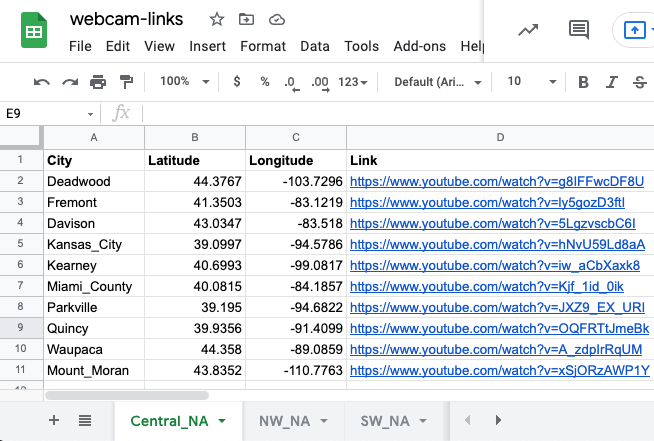
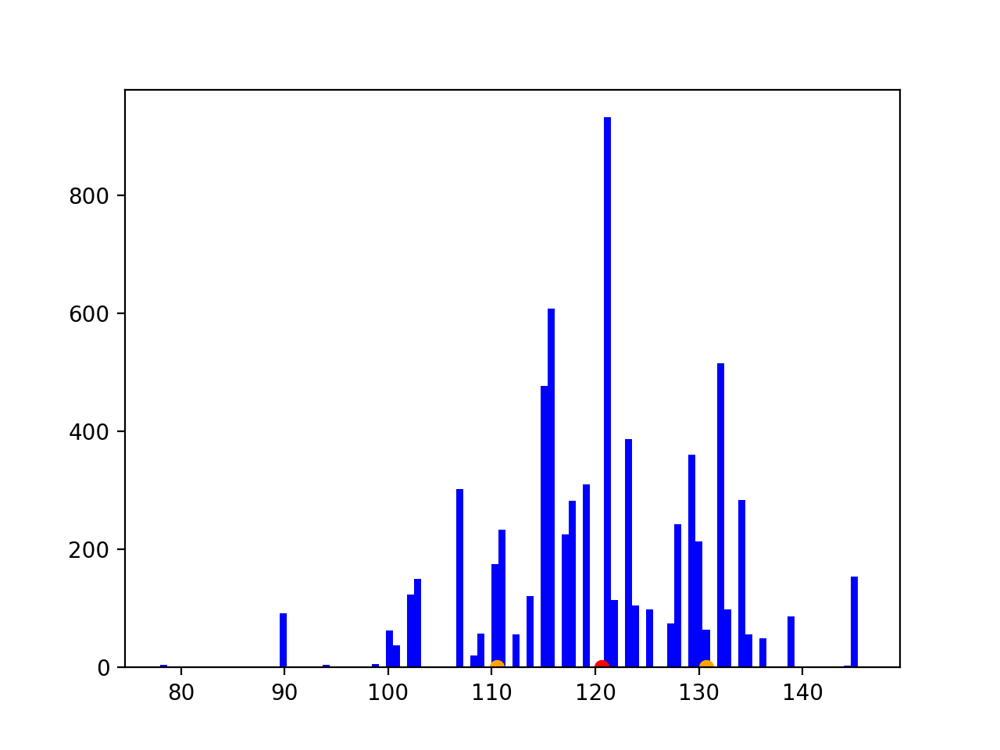
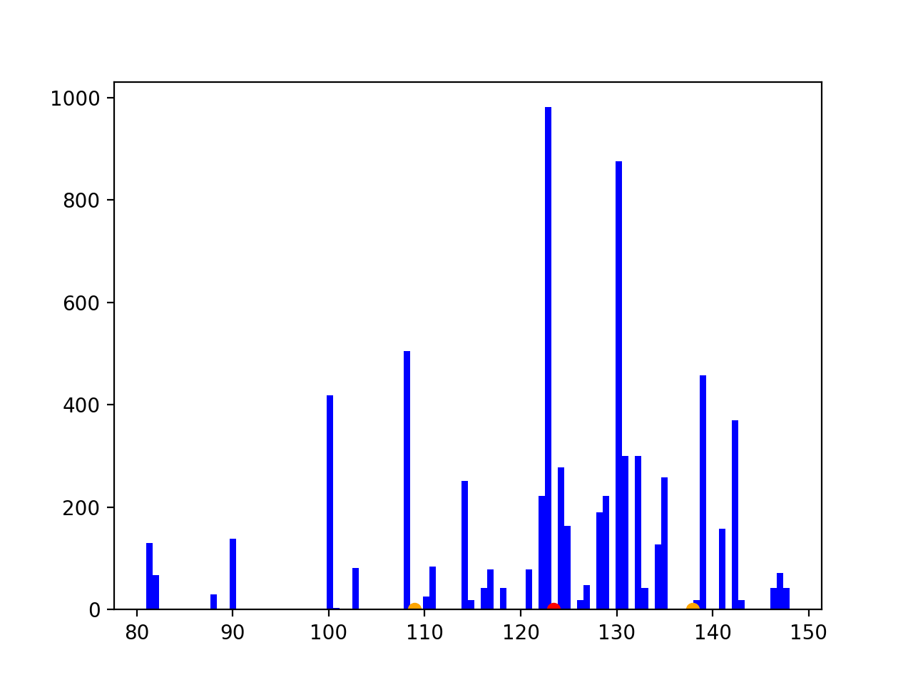

# Auto Rainy Livestream Downloader

This program downloads livestream footage from links specified in a Google Sheet if the location has rain. This downloader was used to obtain a rainy dataset for a research project I am working on.

## How to Use
`python3 auto-downloader.py` downloads forever in an infinite loop to a folder called `downloads` in subfolders automatically named with the year, month, and day a video is downloaded. You can also download a single file with `download.sh` which takes the format `./download.sh https://www.youtube.com/watch?v=Nu15hl3Eu7U 00:00:10 out.mp4`.

## Setup
 1. Create a Google Sheet called __webcam-links__ with
    * each sheet is labeled by region 
    * each sheet contains four columns: `City`, `Latitude`, `Longitude`, and `Link` filled in with the corresponding information.
    * optionally, add a fifth column, `Not Usable`, that, when set to `X` (case insensitive), indicates not to download the video.
 2. You will need to create a Google _service account_ that has the _Google Sheets API_ enabled. 
    * Share the __webcam-links__ Google Sheet with the Google service account created.
    * You will need to create a key for this service account and download it to a file called `google-sheet-service-auth.json` in this directory. Checkout the template of the file [here](google-sheet-service-authTEMPLATE.json).
 3. Install necessary packages with pip (e.g. `pip install -r requirements.txt`). Note that this was tested on MacOS with Python 3.9.5.
 4. Create API keys at https://api.openweathermap.org for "Current Weather Data". Create a `.env` file with a variable called `API_KEYS` and copy-and-paste the keys separated by a comma. A template can be found [here](.envTEMPLATE).

The following is an example of the format for the __webcam-links__ Google Sheet:


## Logging
At some point I will switch to using the `logging` module, but in the meantime, this script will output information including which locations were found to have rain, the ffmpeg commands used, the download paths, and the return codes of ffmpeg processes. The following is an example snippet of one of my download runs:

```console
$ python3 auto-downloader.py
Region: Central_NA
Region: NW_NA
Region: SW_NA
Region: Southern_NA
	Jonesborough has rain
	Plant_City has rain
	Winter_Garden has rain
Region: Shikoku_Chugoku_JPN
Downloading to: ./tmp/Jonesborough_2021-09-01_12-05-35.mp4
Command: ffmpeg -f hls -i https://manifest.googlevideo.com/api/manifest/hls_playlist/expire/1630544736/ei/AM8vYZuRE9Omkgar9ZDIAQ/ip/64.136.131.152/id/ulEKv7LJDxc.1/itag/301/source/yt_live_broadcast/requiressl/yes/ratebypass/yes/live/1/sgoap/gir%3Dyes%3Bitag%3D140/sgovp/gir%3Dyes%3Bitag%3D299/hls_chunk_host/rr4---sn-a5meknzk.googlevideo.com/playlist_duration/30/manifest_duration/30/vprv/1/playlist_type/DVR/initcwndbps/12810/mh/bc/mm/44/mn/sn-a5meknzk/ms/lva/mv/m/mvi/4/pl/19/dover/11/keepalive/yes/fexp/24001373,24007246/mt/1630522832/sparams/expire,ei,ip,id,itag,source,requiressl,ratebypass,live,sgoap,sgovp,playlist_duration,manifest_duration,vprv,playlist_type/sig/AOq0QJ8wRQIgXhN1_9IpFB_YMT_aKzXJ91vkBRK00QNzoLALXc81H2sCIQCXBDlsm3NZbs0u_Ar97cHaIFSW1-nC65H2UXc2DOyIUA%3D%3D/lsparams/hls_chunk_host,initcwndbps,mh,mm,mn,ms,mv,mvi,pl/lsig/AG3C_xAwRQIgKzSa0c6DdybVDVVjnW5beL5Yn3GJP6VyjQhNhCYjHigCIQCPq03kznfELitg-kz7bykslU_EaQz8TXDMDE5s3wHZ8g%3D%3D/playlist/index.m3u8 -t 00:02:00 -c copy -an ./tmp/Jonesborough_2021-09-01_12-05-35.mp4
Downloading to: ./tmp/Plant_City_2021-09-01_12-05-38.mp4
Command: ffmpeg -f hls -i https://manifest.googlevideo.com/api/manifest/hls_playlist/expire/1630544739/ei/A88vYZeoF8v0kgb_taDYCA/ip/64.136.131.152/id/wLC-Zg33RYc.1/itag/301/source/yt_live_broadcast/requiressl/yes/ratebypass/yes/live/1/sgoap/gir%3Dyes%3Bitag%3D140/sgovp/gir%3Dyes%3Bitag%3D299/hls_chunk_host/rr5---sn-a5mekned.googlevideo.com/playlist_duration/30/manifest_duration/30/vprv/1/playlist_type/DVR/initcwndbps/12810/mh/Nc/mm/44/mn/sn-a5mekned/ms/lva/mv/m/mvi/5/pl/19/dover/11/keepalive/yes/fexp/24001373,24007246/mt/1630522832/sparams/expire,ei,ip,id,itag,source,requiressl,ratebypass,live,sgoap,sgovp,playlist_duration,manifest_duration,vprv,playlist_type/sig/AOq0QJ8wRQIgK4ubBYoSI2JtMuE7DhMbVFWCiZT-IZAUkBxnLffTh5ACIQDJSYZq8e9cVxDxm5O20nfvkmVwiOIQyNjUzUxIkYNdvQ%3D%3D/lsparams/hls_chunk_host,initcwndbps,mh,mm,mn,ms,mv,mvi,pl/lsig/AG3C_xAwRQIhAKAni4GDsIzsgIOaZeR0T16sXr2xO2QkZQI_dDtZxAGUAiBJj1dX6eT9ZG5EDa-6iXw4UPa8XiQrIJWOyDfWrq36bw%3D%3D/playlist/index.m3u8 -t 00:02:00 -c copy -an ./tmp/Plant_City_2021-09-01_12-05-38.mp4
Downloading to: ./tmp/Winter_Garden_2021-09-01_12-05-40.mp4
Command: ffmpeg -f hls -i https://manifest.googlevideo.com/api/manifest/hls_playlist/expire/1630544741/ei/BM8vYY-6OtT0kgaQnKa4BA/ip/64.136.131.152/id/gFI5ieIpLzU.1/itag/96/source/yt_live_broadcast/requiressl/yes/ratebypass/yes/live/1/sgoap/gir%3Dyes%3Bitag%3D140/sgovp/gir%3Dyes%3Bitag%3D137/hls_chunk_host/rr6---sn-a5mlrn7k.googlevideo.com/playlist_duration/30/manifest_duration/30/vprv/1/playlist_type/DVR/initcwndbps/12810/mh/hw/mm/44/mn/sn-a5mlrn7k/ms/lva/mv/m/mvi/6/pl/19/dover/11/keepalive/yes/fexp/24001373,24007246/mt/1630522832/sparams/expire,ei,ip,id,itag,source,requiressl,ratebypass,live,sgoap,sgovp,playlist_duration,manifest_duration,vprv,playlist_type/sig/AOq0QJ8wRgIhANtNcAAy2MR9aFgPQxFvyPnXg15m7bEKyJsOPei-bP6iAiEA-1-Y0-iQe9Udvwi-rKvZofoGsxA9vKiebNT56FQSOro%3D/lsparams/hls_chunk_host,initcwndbps,mh,mm,mn,ms,mv,mvi,pl/lsig/AG3C_xAwRQIgNu9xtR7HxPewChUafxmNr_PmE9S974EJZ7dyyxWJ2FECIQDZgkYyYUOkl2k20p0iuxiKDtoCgFWBLPoTvU2ylc1aQQ%3D%3D/playlist/index.m3u8 -t 00:02:00 -c copy -an ./tmp/Winter_Garden_2021-09-01_12-05-40.mp4
Attempting download of 3 video(s).
[0, 0, 0]
Region: Central_NA
Region: NW_NA
Region: SW_NA
Region: Southern_NA
	Jonesborough has rain
	Plant_City has rain
	Winter_Garden has rain
...
```

## Filtering
NOTE: this is still a WIP
`filter.py` uses modified z-scores to determine outliers in a video that might be indicative of rain. Based on a threshold, a video is classified as rainy or not rainy. The current format for calling the script is as follows:
```
usage: filter.py [-h] [-f FRAMES] [-t THRESHOLD] [-w n] [--plot] [-b BINS] [--csv] folder

filters rainy and non-rainy videos

positional arguments:
  folder                folder with videos

optional arguments:
  -h, --help            show this help message and exit
  -f FRAMES, --frames FRAMES
                        frames to process, defaults to all frames
  -t THRESHOLD, --threshold THRESHOLD
                        threshold for the percentage of outliers to be considered rain drops, default is 2.0 (e.g. 2.0%)
  -w n, --window n      nxn window of pixels in center of image to process. Default is 2x2.
  --plot                displays plots of the histogram of intensities for each video
  -b BINS, --bins BINS  number of bins to display in the histogram plots
  --csv                 output csv format
```
The following is an example of running the script:
```console
$ python3 filter.py ./sample_data --plot
processing Greencastle_2021-09-09_12-58-45_clean.mp4
        number of outliers: 96, total number of intensities: 7200, percent outliers: 1.33
        mean: 120.60, std: 10.11
        not rainy
processing Greencastle_2021-09-09_12-20-14_rainy.mp4
        number of outliers: 366, total number of intensities: 7200, percent outliers: 5.08
        mean: 123.42, std: 14.46
        rainy
```
### clean image histogram:


### rainy image histogram:


The following is an example of how to create a csv file:
```console
$ python3 filter.py downloads/2021-09-18 --csv > 2021-09-18.csv
processing Auron_Ski_2021-09-18_15-03-14.mp4
processing Revelstoke_2021-09-18_15-10-19.mp4
processing Geiranger_2021-09-18_16-53-48.mp4
processing Revelstoke_2021-09-18_16-49-10.mp4
$ cat 2021-09-18.csv
file,rainy,mean,std,outlier count,total intensities,percent outliers
Auron_Ski_2021-09-18_15-03-14.mp4,False,129.83,38.29,5,3600,0.14
Revelstoke_2021-09-18_15-10-19.mp4,False,58.56,7.94,0,7200,0.00
Geiranger_2021-09-18_16-53-48.mp4,True,66.91,4.20,150,3600,4.17
Revelstoke_2021-09-18_16-49-10.mp4,False,57.07,5.09,0,7200,0.00
```